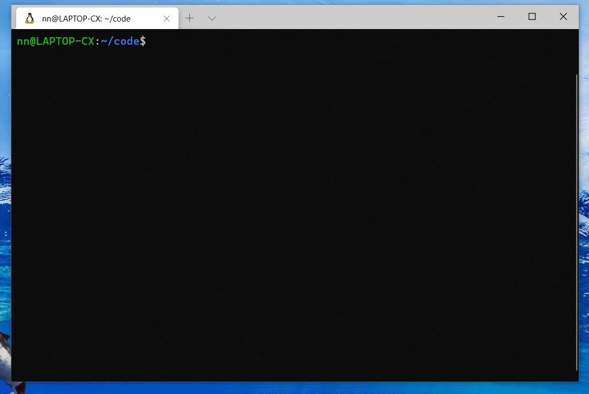

# 🌏 Create Cesium

[](https://www.npmjs.com/package/create-cesium)

Create blazing fast Cesium apps with no configuration, based on [vite-plugin-cesium](https://github.com/nshen/vite-plugin-cesium).

- 📢 Cesium + React template ( new )
- 📢 Cesium + Vue 3 template ( new )
- 📦 Both TypeScript and JavaScript
- 🔑 Fully Typed Cesium ES6 API
- 💡 Instant Dev Server Start
- ⚡️ Lightning Fast HMR
- 💖 Optimized Build

## Quick Start

create a new project just run:

```bash
yarn create cesium
```

or with **npx**

```bash
npx create-cesium
```

Then follow the prompts !



## License

[The MIT License](http://opensource.org/licenses/MIT)

This Project was forked from [Vite](https://github.com/vitejs/vite).
